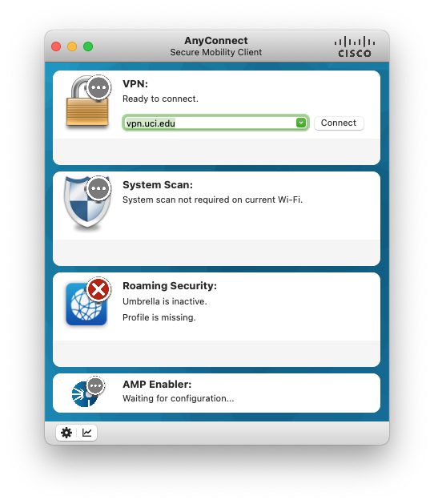
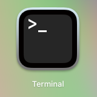
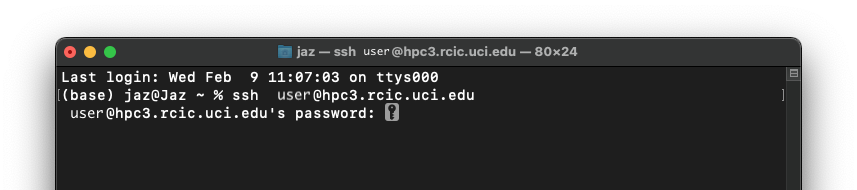
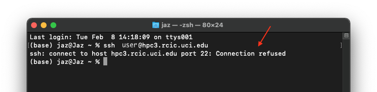
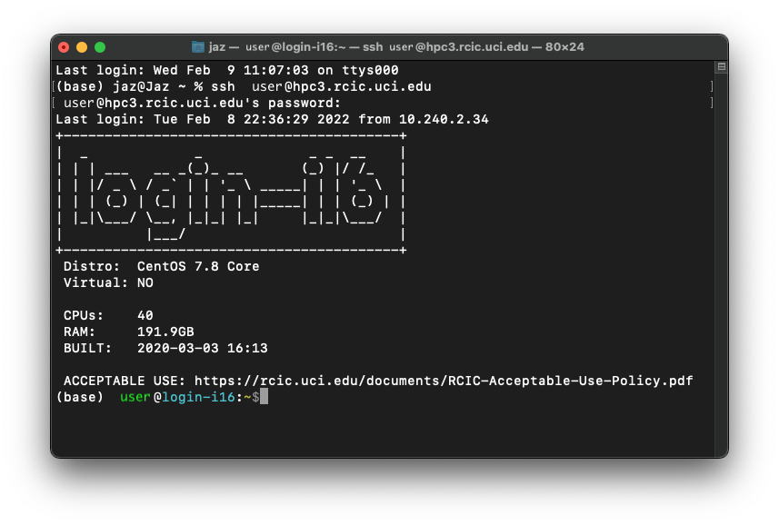

# Get Your Script On the HPC

So you've written a script and now you need to run it. You could be wondering: How to I get my script onto the HPC? Let's look at some ways how. The examples provided fall under two categories, through the terminal or third party software.

## Through the Terminal

Using the terminal will require to to be connected to the school WIFI/VPN and SSH into the HPC before sending your script.

What is SSH? - * coming soon *

### Connecting with the terminal

Note: Again, before you start, make sure your computer is connected to the school's designated VPN if you are not on campus. You will not be able to connect to the HPC without doing this FIRST. At our universtiy, it looks like this (at the time of writing):

Next, find your terminal.

**On a Mac:**
The application is called Terminal and icon looks like this (at time of writing). It comes preinstalled on every computer, you will just need to use the search feature to find it.

**On a PC**

**On a Chromebook:**

---

At our university, to connect the the HPC, you would ssh into the address `user@hpc.rcic.uci.edu` where `user` is your UCI ID. when you run the command, you will be prompted for your UCI ID password and will look something like this:

---

If you tried to connect to the HPC without connecting to the VPN (again, this is if you are off campus), it will look something like this:

---

Once you have entered your password and successfully connected to the HPC, it will look something like this:

---

### Adding the Script

coming soon *
