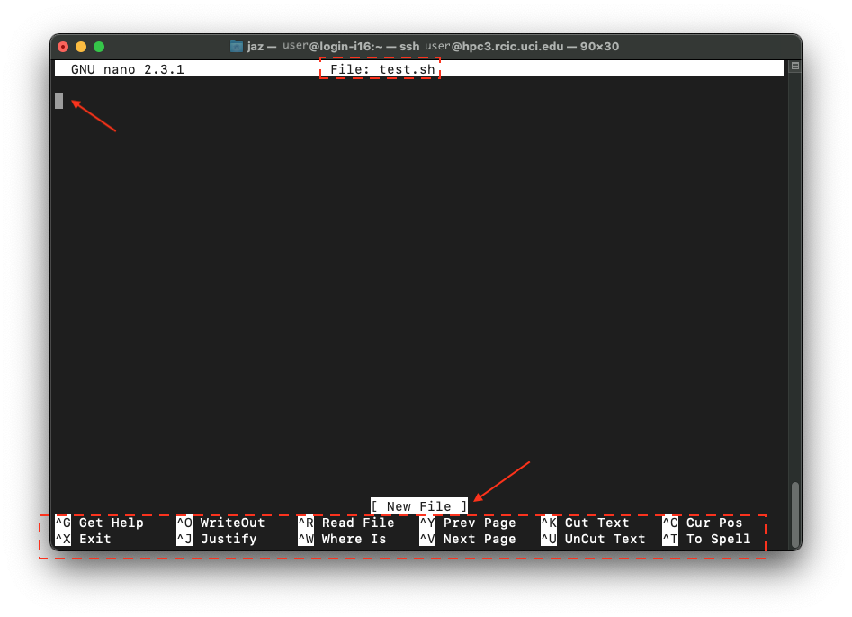
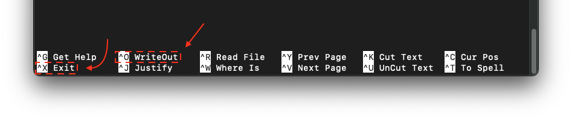
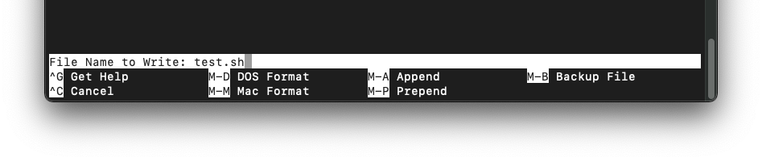
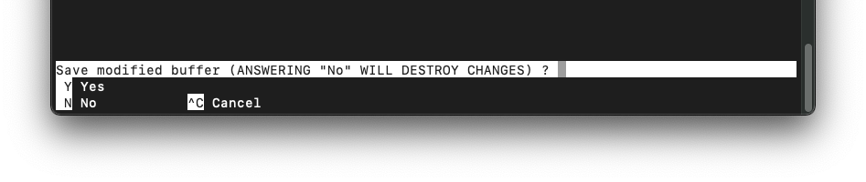
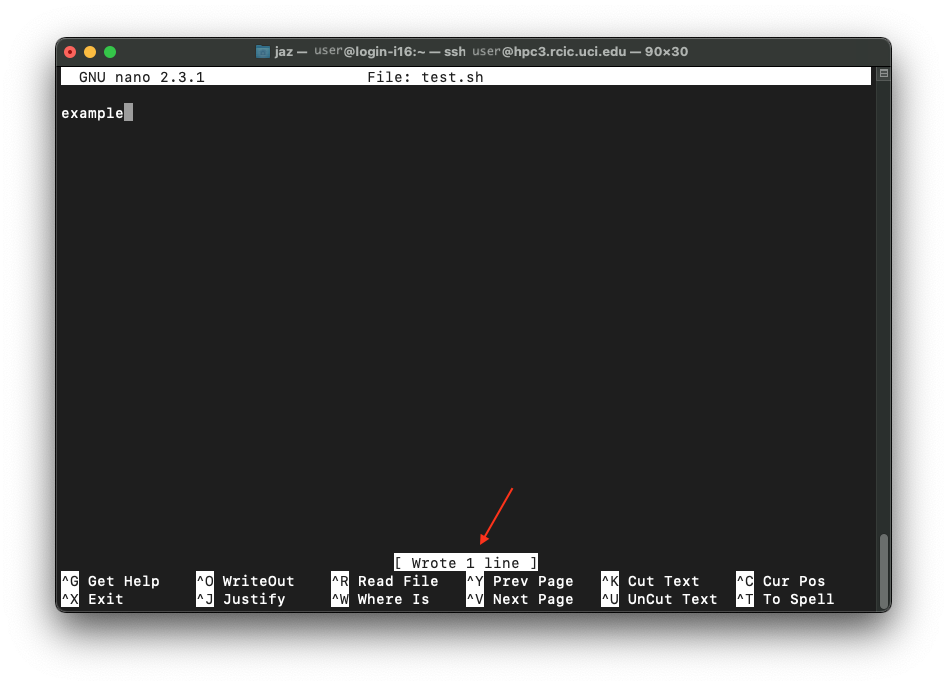

# Get Your Script On the HPC

So you've written a script and now you need to run it. You could be wondering: How to I get my script onto the HPC? Let's look at some ways how. The examples provided fall under two categories, through the terminal or third party software.

## Through the Terminal

Using the terminal will require to to be connected to the school WIFI/VPN and SSH into the HPC before sending your script.

What is SSH? - * coming soon *

### Connecting with the terminal

Note: Again, before you start, make sure your computer is connected to the school's designated VPN if you are not on campus. You will not be able to connect to the HPC without doing this FIRST. At our universtiy, it looks like this (at the time of writing):

Next, find your terminal.

**On a Mac:**
The application is called Terminal and icon looks like this (at time of writing). It comes preinstalled on every computer, you will just need to use the search feature to find it.

**On a PC**

**On a Chromebook:**

---

At our university, to connect the the HPC, you would ssh into the address `user@hpc3.rcic.uci.edu` where `user` is your UCI ID. when you run the command, you will be prompted for your UCI ID password (NOTE: it will not show you typing out your password) and will look something like this:

---

If you tried to connect to the HPC without connecting to the VPN (again, this is if you are off campus), it will look something like this:

---

Once you have entered your password and successfully connected to the HPC, it will look something like this:

---

### Create the Script in the Terminal

Once you are in the folder you'd like your script to be, you can create the actual script file itself like opening an empty word document. You can do this with either of Linux's text editors, `vi` or `nano`. `nano` is easier to use for beginners because its layout looks a little like a graphical interface so this is what we will be using for your example. For information about how to use `Vi`, check out this [page](https://www.pluralsight.com/blog/it-ops/linux-text-editors-vi-nano#:~:text=Vi%20is%20a%20standard%20whereas%20Nano%20has%20to,name%20and%20the%20file%20will%20be%20created%20anew.).

To create our script file using `nano`, run `nano <your_script_name>.sh` where you replace `<your_script_name>` with the name you want (so not include `<` or `>`). In this example, we created a the script "test.sh" by running `nano test.sh`.

Then screen will change to look like a fake pop up window opened within the terminal. This is a blank script file you just created opened in the nano text editor. It will look like this:

Notice `File: test.sh` near the top of the window, indicating the file we have open. If you had ran `nano` without a file name, it would say `New Buffer` instead, indicating that you created an unsaved file. The top arrow is pointing at where our cursor is and where we will start writing code. The bottom arrow is pointing at a white box that displays a “system message” line that displays messages related to the `nano` package. The very bottom section displays the some common keyboard shortcuts.

Now you can either type it all out or copy and paste your code that was written else where. It's easier to write out code on your local computer using a text editor and then copying and pasting it into the nano window on the terminal. This is especially true for long code and major edits because being able to use your computer mouse can make your life easier.

some good text editors * coming soon *

When you have your all your code in the nano window on your terminal, you need to save your changes. This is like how when you save a word document before you exit. For `nano`, we are going to write out our changes and exit using their respective keyboard short cuts.

First you are going to press "ctrl + o" to save your changes. The system message will change to say `File Name to Write:` and the file that the changes will be saved to, in our case it's `test.sh`. It will look something like this:

Press "enter" on your keyboard to confirm.

If you didn't press "ctrl + o" before trying to exit out of the `nano` window, the system message will say something like this:

Once you have saved the script, it will look something like this:

In our `test.sh` script we only wrote "example", this is why the system message says `Wrote 1 line`.

#### You could also...

use a Text Editer to write out your script and then copy and past it into the nano window! This is much easier if you are working with long code. Some Text Editors include: [Sublime Text](https://www.sublimetext.com), [Atom](https://atom.io), [BBEdit](https://www.barebones.com/products/bbedit/index.html) (macOS) & [Notepad++](https://notepad-plus-plus.org) (windows).

For more information about using `nano`, check out this [page](https://www.howtogeek.com/howto/42980/the-beginners-guide-to-nano-the-linux-command-line-text-editor/).

## Upload with Third Party Application

\* coming soon * 
