# Miniconda Installation Instructions With Images For Beginners

## Download and install `miniconda`


1. Go to [Miniconda page on Anaconda website](https://docs.anaconda.com/free/miniconda/) (click the link).
2. Under the [Latest Miniconda Installer Links](https://docs.anaconda.com/free/miniconda/#latest-miniconda-installer-links) section, right click [Miniconda3 Linux 64-bit](https://repo.anaconda.com/miniconda/Miniconda3-latest-Linux-x86_64.sh) in the Linux section and copy the link.
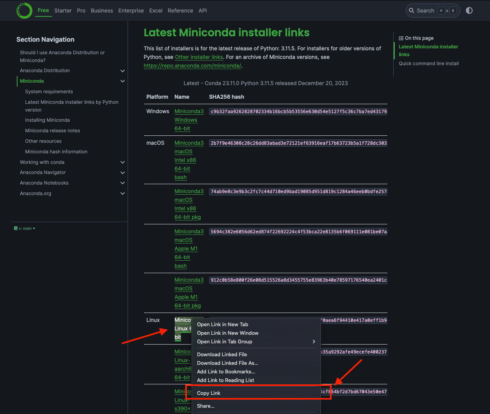

---

3. In the Terminal, type `wget` then paste the link you copied.
```bash
wget https://repo.anaconda.com/miniconda/Miniconda3-latest-Linux-x86_64.sh
```
 This will download the script that will install miniconda. It will look something like this:
 
 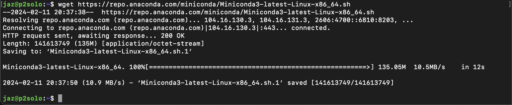

---

4. Run the script to install `miniconda`. 
```bash
bash Miniconda3-latest-Linux-x86_64.sh
```
It will look something like this (your Miniconda version might be different):

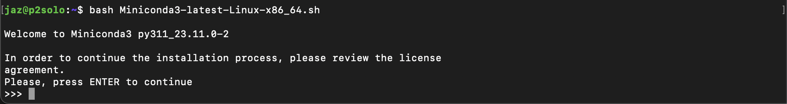

---

5. Review the license agreement by pressing the ENTER key. It will look something like this:

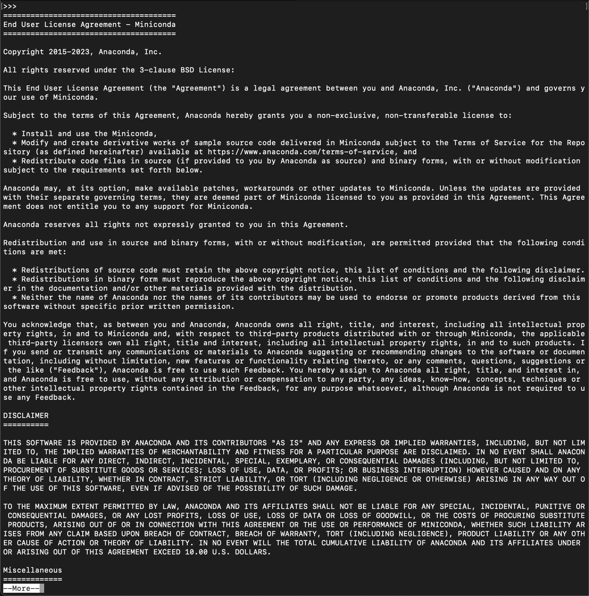

---

Keep pressing ENTER past the `Export; Cryptography Notice` section until it asks you `Do you accept the license terms? [yes|no]`.  Type `yes`. Will look something like this:

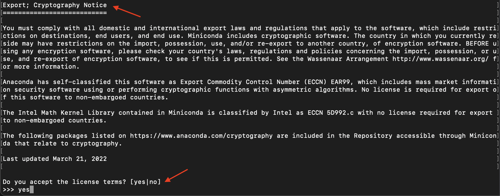

---

6. Before installing, it will ask you to confirm location of installation. If you were at the location you wanted to install miniconda before starting these instruction, then the path that you see should be were you are at. If so, press ENTER. Otherwise, specify the path. It will look something like this:

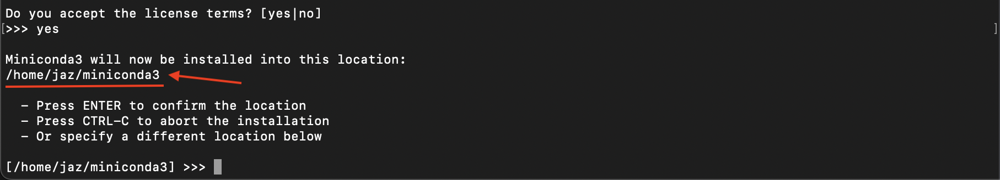

---

7. When installation is finished, it will ask if you want to initalize `conda`. In other words, do you want conda to be activated once you long in. I would answer `yes`. It will look something like this:

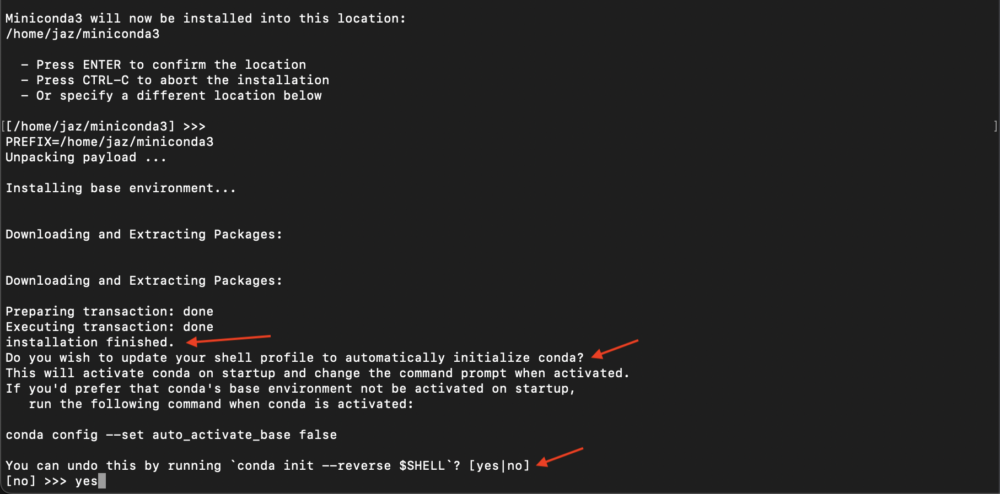

---

8.  When everything is complete, it will look something like this:

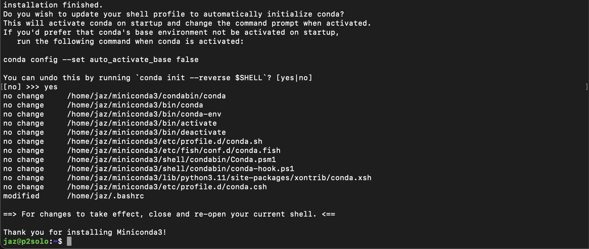

---

9. To be able to start using conda now without restarting or logging back in, run `source ~/.bashrc` ([`.bashrc`](https://www.digitalocean.com/community/tutorials/bashrc-file-in-linux) is for linux systems) in the Terminal. When you use `conda` for the very first time, you will notice `(base)` (boxed in red in screenshot) appear in the command line prompt. This indicates that `conda` is active and that the current environment is `base`. It will look something like this:

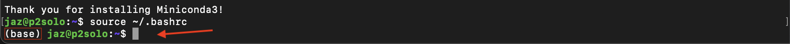

---

10. Finally, update `conda` to the latest version by running `conda update conda` and enter `y` when it says `Proceed ([y]/n)?`. It will look something like this:

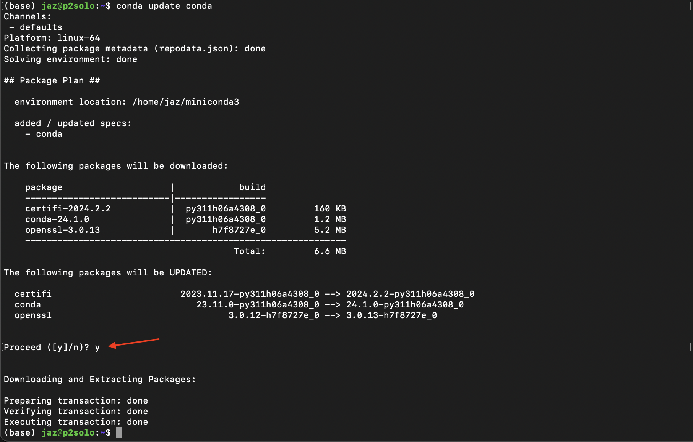

---

Congratulations, you have installed `conda`!

---

## Configure `conda`

For those doing bioinformatics, many packages may come from the [`bioconda` channel](https://bioconda.github.io). This is not installed by default and can be easily installed.

1. Enter the following lines of commands in the following order (order here matters!):
```bash
conda config --add channels bioconda 
conda config --add channels conda-forge 
conda config --set channel_priority strict
```
(For more information about these commands, see the [`bioconda` documentation under “What did these commands do?“ in the “Usage” section](https://bioconda.github.io/#usage))

It will look something like this:

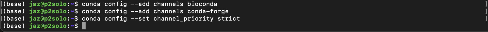

---

2. Finally, update `conda` by running `conda update conda` and enter `y` when it says `Proceed ([y]/n)?`. It will look something like this:

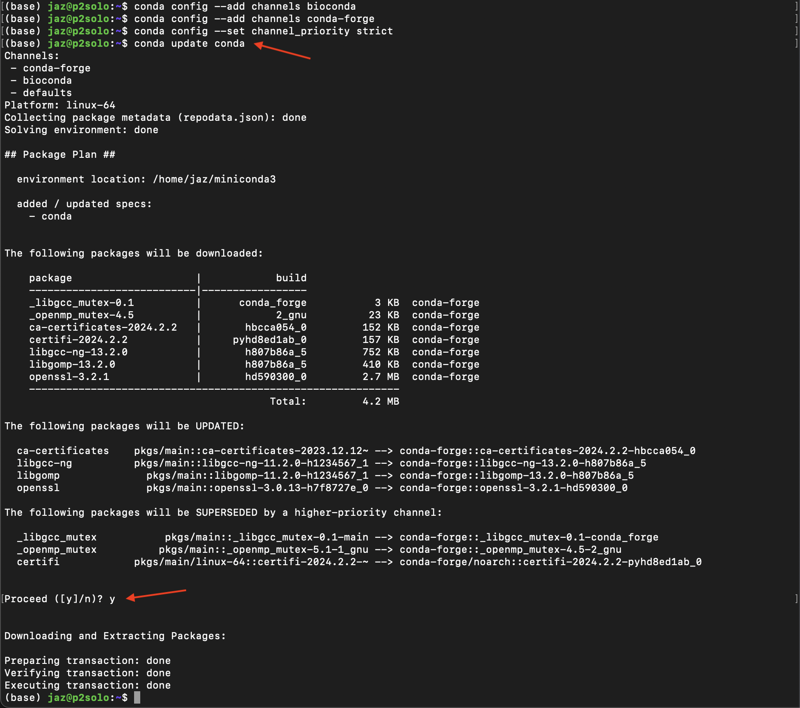
