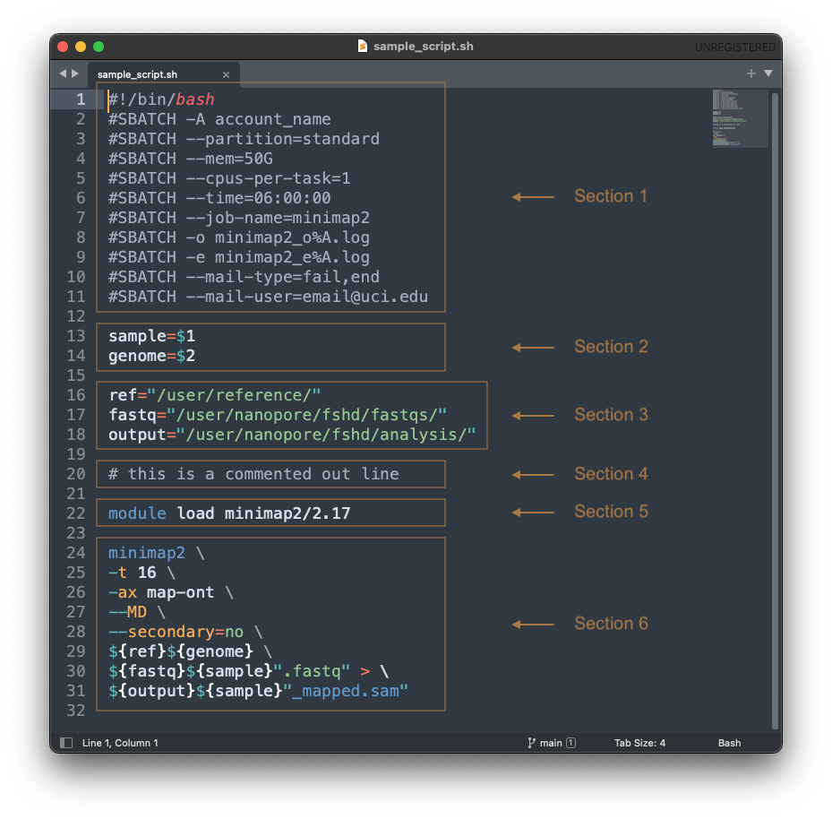

# Script Writing
You have done some experiments or downloaded datasets of several samples, and you want to start doing analysis. You will need to write a script!

Scripts could be written in so many ways. Some are strict requirements, while some are purely personal preference. We will look at an example script. This one in particular is tailored toward mapping a sample, `sample1`, to a genome, `human_genome.fa`, using the `minimap2` package.

---
# Example Script


---
# Section 1
The HPC3 uses a SLURM scheduler and that is why we have to put `#SBATCH`. This is called a **bash header** and it provides instructions to the SLURM. This bash header **MUST**	be included at the top of every bash script.

## Here is what each line means:

`#!/bin/bash` --> this MUST be the first line

`-A SEYEDAM_LAB` --> who to charge money for the job

`--partition=standard` --> indicates that this is a paid job, not free

`--mem=50G` --> request 50G of memory

`--cpus-per-task=1` --> request 1 CPU

`--time=06:00:00` --> run job for no more than 6 hrs

`--job-name=minimap2` --> the name of the job (just for our convenience)

`-o minimap2_o%A.log` --> request standard output log with job name (in this case "minimap2") & number (job number is generated automatically once job is submitted)

`-e minimap2_e%A.log` --> request standard error log with job name (in this case "minimap2") & number (job number is generated automatically once job is submitted)

`--mail-type=fail,end` --> send an email when job fails or ends

`--mail-user=user_email@uci.edu` --> which email to send to

---
# Section 2

This section assigns **variables** to the **command line arguments**. This essentially allows you to use a script as a template with fill-in-the-blank like capabilities. When you submit the job through the command line, you will provide information that fills in the blanks, called **command line arguments**. You could have as many arguments as you want.

An example application would be using a script designed in this way: to
- map multiple samples with the same parameters
- keep the same parameters but change reference genomes
- and more

NOTE: order of the command line arguments is **IMPORTANT**! In our example, if we want to assign our sample name to the variable `sample`, we must list it as the first command line argument because `$1` means that the first command line argument will be assigned to the variable `sample`.

For our sample script, the arguments will be written after the script like this:
```bash
sample_script.sh sample1 human_genome.fa
```
---
# Section 3
This section tells the HPC were all the files it need to run the job is located.

To make things easier and cleaner, we will also be assigning the files along with its location to a **variable**. Just like how we assigned the command line arguments to a variable in Section 2.

## File & Directory Paths
To give the location of a file, you must know its filesystem hierarchy. In our example, if we saved our input file `sample1.fastq` in the `fastq` **directory** (means folder), which is located in the `fshd` directory, which is located in the `nanopore` directory, which is in our `user` directory, then providing the file path a little like giving someone street directions to a destination.

Specifically, our file path would look like this:

```
/user/nanopore/fshd/fastqs/sample1.fastq
```

- each subdirectory is separated by `/` and it
- `/` must be included in the very beginning

NOTE: This script was written to be able to substitute different sample names using the same script with command line arguments so we will NOT include the file name in when we assign the path to the variable.

---
## Assign Path to Variable
To assign this path to a variable, write:

```bash
fastq="/user/nanopore/fshd/fastqs/"
```
- path must be within quotations marks

---
# Note on **Variables**
Once you have assigned a variable, you **call it** (which means use it) anywhere in the script by writing the variable within `${}`, for example `${sample}`.

---

# Section 4

When you regularly write complex codes or scripts, you will find that you need to write notes to yourself. How do you write a note to yourself without the HPC trying to execute it as a command? By using the `#`. EXCEPT for the bash header, the HPC will ignore any line of code that begins with `#`. Getting into the habit of including comments will help you stay organized and share your code!

---

# Section 5
In the same way that you can't start listening to music without opening the app first, you must load the software or **package** you need. `module load` is the command that opens packages. To load the mapping package used in the example, we would write

```bash
module load minimap2/2.17
```
- `/2.17` tells the HPC3 which version of minimap2 to use
  - it sis really important to keep track of what version of packages you use!

---
# Section 6
The way this section is written is entirely dependent on the software itself.  READ THE PACKAGE **DOCUMENTATION** (same as a software manual). Get into the habit of reading documentation. Packages are always updated and you might discover a feature that will help your analysis.

According to the minimap2 [documentation](https://lh3.github.io/minimap2/minimap2.html#10) and [GitHub page](https://github.com/lh3/minimap2), the syntax looks something like this `minimap2 -x [preset] -[options] ref.fa file.fastq > output.sam`

The minimap2 command with our variables look like this:

```bash
minimap2 \
-t 16 \
-ax map-ont \
--MD \
--secondary=no \
${ref}${genome} \
${fastq}${sample}".fastq" > \
${output}${sample}"_mapped.sam"
```

- `-ax map-ont` --> is the preset
- `-t 16`, `--MD`, `--secondary=no` --> are some options
- `${ref}${genome}` --> our reference genome file name and its location
- `${fastq}${sample}".fastq"` --> our fastq file name and its location
  - since our variable `${sample}` is just the same of the sample without the file extenstion, `".fastq"` adds `.fastq` to the whatever is in the `${sample}`
- `>` called an [**redirection operator**](https://unix.stackexchange.com/questions/159513/what-are-the-shells-control-and-redirection-operators), will tell HPC were to put the output of the mapping
- `${output}${sample}"_mapped.sam"` the file to put the mapping out put (as redirected by `>`)
  - the file that will save the mapping out put will be called whatever is in the `${sample}` variable with `_mapped.sam` added to it.
- `\` ad the end of each line allows us to break up one command into a continuous command that is written on multiple lines. This makes it easier to read and write.
  - if `\` is accidently omitted, the HPC will interpret it as an incomplete command.

  ---

# Putting It All Together
We submit the script by running:

```bash
sbatch sample_script.sh sample1 human_genome.fa
```

When the HPC reads this script and load minimap2, it will call all the variables you have assigned and will look like this:

```bash
minimap2 -t 16 -ax map-ont --MD --secondary=no /user/reference/human_genome.fa /user/nanopore/fshd/fastqs/sample1.fastq > /user/nanopore/fshd/analysis/sample1_mapped.sam
```

---

If we have more samples, say `sample2`, `sample3`, etc, we can run the same script again but with the new sample name as the first variable.

**NOTE**: this will only work IF all the file locations are the same. Otherwise, we need to edit the script so that we can pass file paths as a command line argument.
  - try to write that script to challenge yourself!
